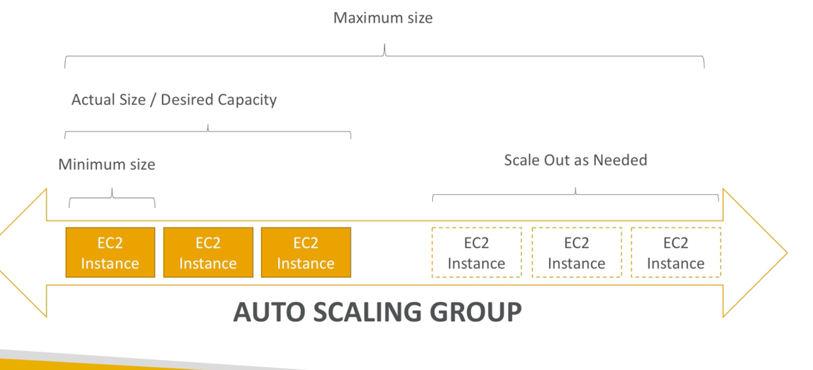

# autoscaling_groups
Goal of the ASG (autoscaling group) is to
* scale out (add EC2 instances) to match an increased load
* scale in (remove EC2 instances) to match a decreased load
* Ensure we have a minimum and maximum number of machines running
* automatically register new instances to a load balancer

Autoscaling groups have the following attributes:
* Launch Configuration
  * AMI + Instance Type
  * EC2 User Data
  * EBS Volumes
  * Security Groups
  * SSH Key Pair
* Min size / Max size / Initial capacity

## Autoscale alarms
* Possible to scale on Cloudwatch Alarms
* Can monitor a metric i.e. average CPU
* Metrics are computed for the overall ASG (average over all machines in autoscaling group)

## Autoscale new rules
* possible to define better scaling rules directly managed by ec2
  * Target average cpu usage
  * Number of requests on the ELB per instance
  * average network in/out

## Autoscaling Custom metric
* can autoscale based on custom metric (example: number of connected users)
  1.  Can send custom metric from app on EC2 to cloudwatch using putMetric api
  2.  Create cloudwatch alarm on to react to low or high values of metric
  3.  use cloudwatch alarm as the scaling policy for asg

## ASG Good to know
* IAM roles attached to ASG get assigned to EC2 Instances
* ASGs use Launch configurations and you update an ASG by providing new launch configurations
* Scaling policies can be on CPU, Netowrk and even on custom metrics or based on a schedule
* ASGs are free, you pay for underlying resources i.e. ec2
* Instances under an ASG mean if they get terminated for whatever reason ASG will restart them (extra safety)
* ASG can terminate unhealthy instances and replace them

