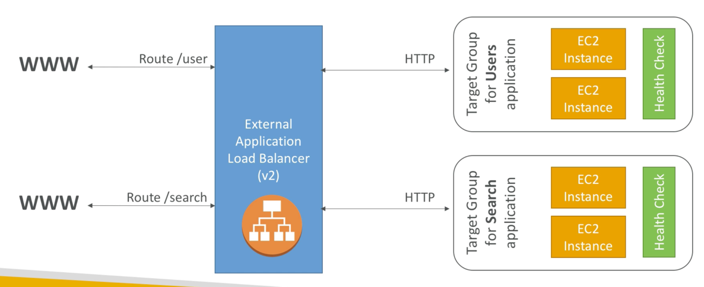
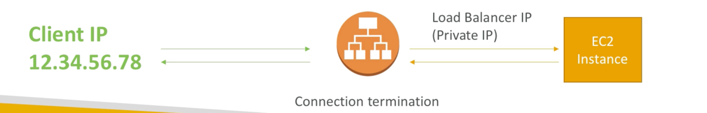

# elastic_load_balancer
* Expose single point of access (DNS) to application that may have multiple nodes
* Enforce HTTPS
* Cookie stickyness
* High availability
* Separate traffic
* Spread load
* Seamlessly handle failures

Elastic load balancer is a managed load balancer,
* AWS guarantees that it will be working
* AWS performs upgrades and maintenance
* AWS provides ways to configure it

Costs less to configure your own load balancer but requires more effort to setup and maintain

3 Types of Load balancers
* Classic load balancer v1
* Application Load balancer v2
* Network Load balancer v2

Amazon recommends v2 balancers, Application and network balancers will be on the exam

Can setup internal or external load balancers

# Health Checks
* Crucial for load balancers
* Health check is done on a port and route (/health is typical, typical response is a http 200 resp)

# application balancer (Layer 7)
* Load balancing to multiple http application across machines (target groups)
* Load balancing to multiple applications on the SAME machine (ex: containers)
  * Typical question on exam, what do we use to load balance apps on same machine: application balancer
* Load balancing based on route in URL
* Load balancing based on hostname in URL
* Great for docker/ecs
* can redirect to any dynamic port in the backend
* Compared to v1, v1 would require 5 load balancers for 5 applications, v2 requires 1 application balancer
* Target groups can contain as many ec2 instances as required

# application balancer good to know
* Stickiness can be enabled at the target group level
  * same request goes to the same instance
  * cookie generated at application load balancer level
* ALB supports HTTP/HTTPS/Websocket
* Application servers dont see ip of the client directly it sees the load balancer ip (popular on exam)
  * true ip of the client is inserted in the header X-Forwarded-For
  * can also get Port (X-Forwarded-Port) and Proto X-Forwarded-Proto

# Network Load Balancer
* Layer 4 TCP level
* Millions of requests per seconds
* less latency ~100ms vs ~400 for ALB
* Support static or elastic IP
* Typical for extreme performance
* Same balancing as http ALB

# Load balancer good to know
* CLB, ALB, NLB has a static host name, Do not resolve underlying IP
* LB can scale but not instantaniously, contact AWS for a "warm-up" (took about 3 minutes for me)
* NLB directly see ip of client
* 4xx errors are client induced errors
* 5xx errors are application induced errors
* 503 means capacity limit
* if lb cant access application check security groups
