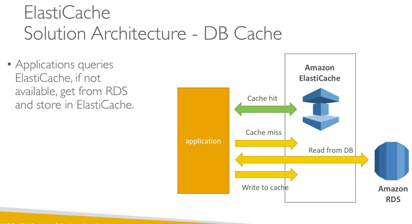
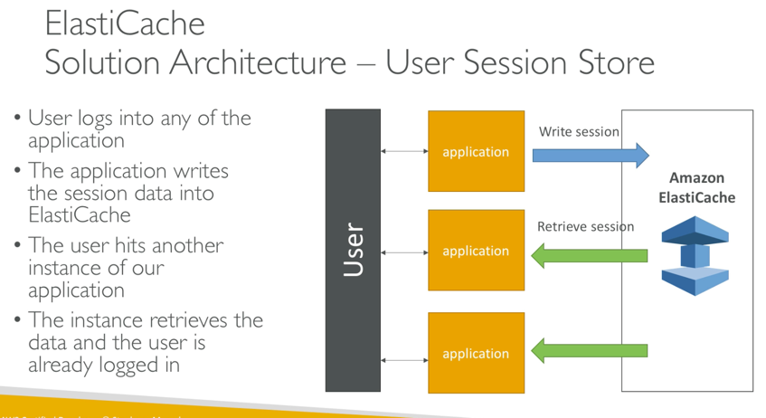
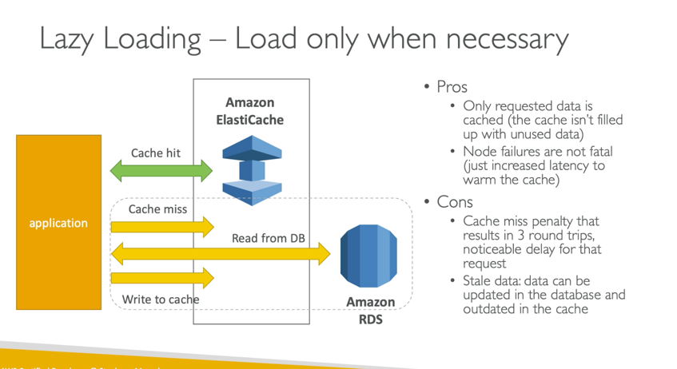
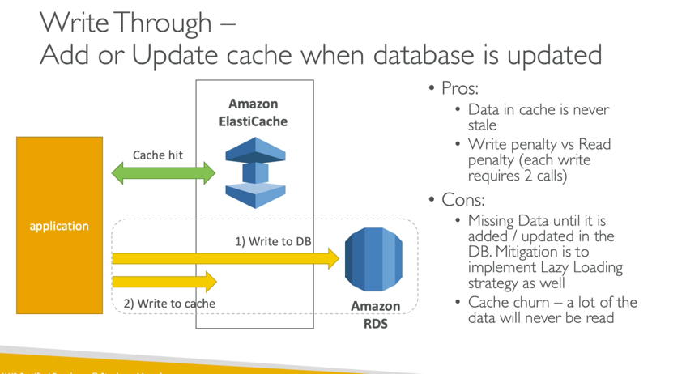

# AWS ElastiCache
* InMemory database (ram) with high performance and low latensy
* Helps reduce load on database for read intense workloads
* Redis or memcached
* Makes application stateless
* Multi AZ with failover
* Read Scaling, Read Replicas
* AWS maintains solution i.e. patching

* Cache Hit: Data exists in cache and is in sync with RDS, RDS will not be contacted
* Cache Miss: Data missing or stale in cache, data is retrieved from RDS and returned to application and written back to cache

User session store pattern, application is stateless, the users session exists in the cache and not RDS.

## Redis
* InMemory Key value store
* Super low latensy
* Cache survives reboots by default (persistence)

Ideal for
* User sessions
* Leaderboards (sorting)
* Relieve pressure on db
* Publisher Subscriber capability
* MultiAZ with automatic failover for DR if you dont want to lose cache data

## MemCached
* InMemory object store
* cache doesnt survive reboots

Exam will not ask about Redis or MemCached but just elasticache in general

# Elasticache Patterns
* Useful for Read-Heavy application workloads (social networks, media sharing, Gaming etc) and compute-intense workloads
* There are 2 patterns/cache strategies for elasticache
  * Lazy Loading
    * We check the cache, if its missing we retrieve from the database, write to cache and then return  

  * Write Through
    * Every write to database we write to the cache so that the cache will never have a cache miss
    * This strategy requires a cache almost as large as the database

