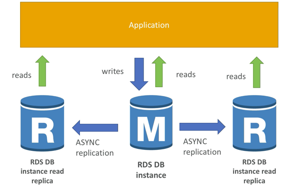

# RDS Relational Database Service

Managed DB service
Supports:
* Postgres
* Oracle
* MySQL
* MariaDB
* Oracle
* Aurora

Advantage:
* Managed Service
* OS patching
* Dashboards
* Continuous backups and restores
* Multi availability zones for disaster recovery (DR)
* Maintenance windows for upgrades
* Scaling capability both vertical and horizontal

Disadvantage:
* No ssh available

RDS Read Replicas:
* read scalability, up to 5 read replicas within AZ, Cross AZ or Cross Region
* Replication is ASYNC so reads are eventually consistant
* Replicas can be promted to their own database
* Applications must update the connection string to leverage read replicas

RDS Multi AZ Disaster Recovery:
* SYNC replication
* One DNS name - automatic app failover to standby
* Increase availability
* Failover in case of loss of AZ, loss of network, instance or storage failure
* No manual intervention in apps
* not used for scaling

RDS Backups
* automatically enabled
* automated backups
  * Daily full snapshot
  * capture transaction logs in realtime
  * ability to restore to any point in time
  * 7 days retention with extension to 35 possible
* DB Snapshots
  * Manually trigger by the user
  * Retention of backups as long as you like

RDS Encryption
* Encrypted at rest with AWS KMS AES-256
* SSL Certs to encrypt in flight
* To enforce SSL
  * Postgres: rds.force_ssl= 1 in the AWS RDS Console (Parameter groups)
  * MySQL: within the DB, GRANT USAGE ON *.* TO 'mysqluser'@'%' REQUIRE SSL;
* To connect using SSL
  * provide ssl trust cert
  * provide ssl options when connecting to database

RDS Security
* Typically deployed within a private subject not public
* RDS Security works by leverage security groups
* IAM policies control who can manage RDS
* Traditional username and password can be used to connect to database

RDS vs Aurora
* Propietary AWS tech but not open source
* Postgres amd mysql both supported as Aurora DB, existing drivers will work as if aurora was mysql or postgres
* Aurora is AWS cloud optimized, claims 5x performance over mysql on rds and 3x performance over postgres on rds
* Aurora storage grows in increments of 10gb up to 64tb
* Aurora can have 15 replicas while mysql has 5, replication is also faster
* failover in Aurora is instant, its High Availability Native
* Costs about 20% more but its more efficient