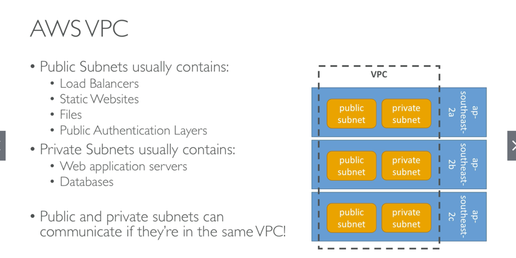
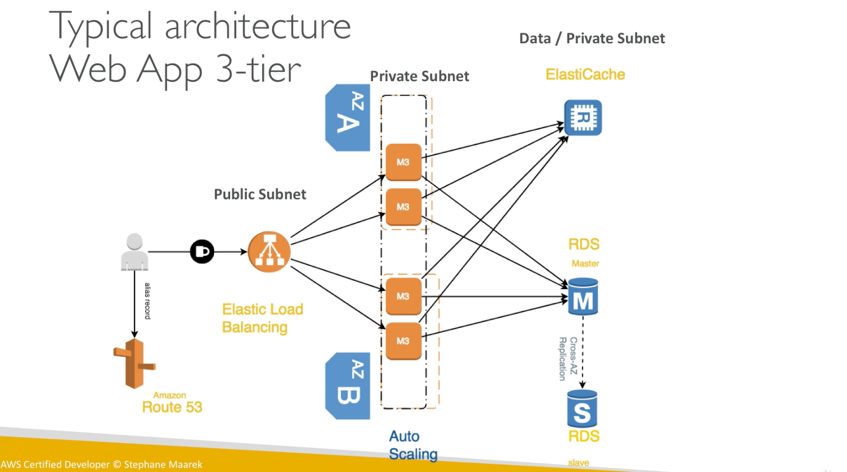

# Virtual Private Cloud
* Within a region you can create VPC's
* Each VPC contains subnets
* Each subnet must be mapped to an Availability Zone
* Its common to have a public and public subnet (IP)
* Its common to have many subnets per AZ

## Good to know
* VPC and Regions are not asked about much on the exam
* All new accounts come with a VPC
* Its possible to use a vpn to connect to a vpc and access all private IP straight from laptop
* VPC Flow logs allow traffic monitoring
* VPC are per account and per region
* Subnets are per VPC per Availability Zone
* Some AWS resources cant be deployed in a VPC
* You can peer VPC (within or across accounts) to make them appear they are on the same network

