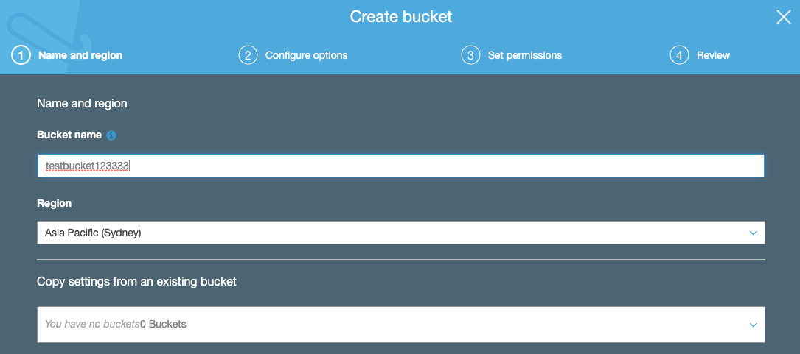
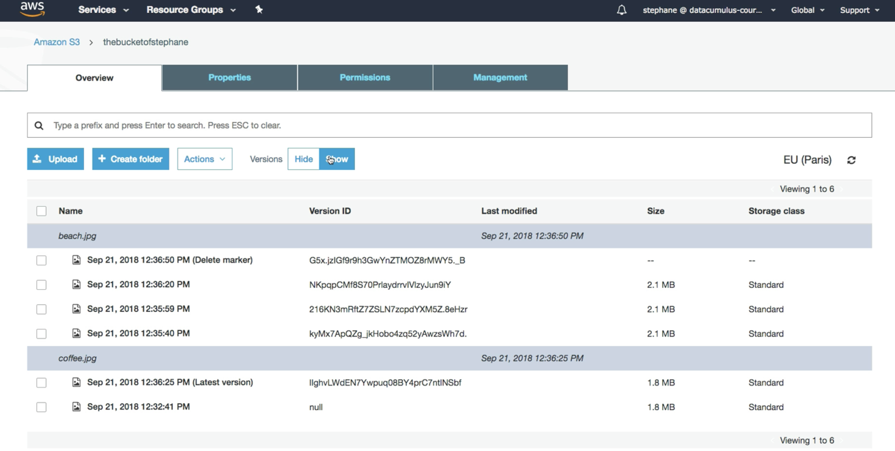
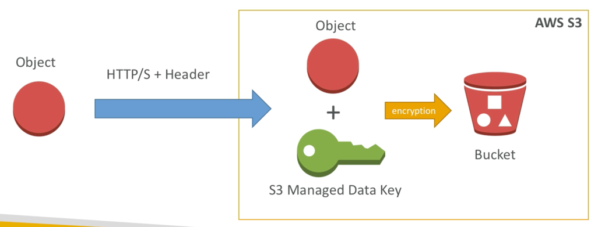
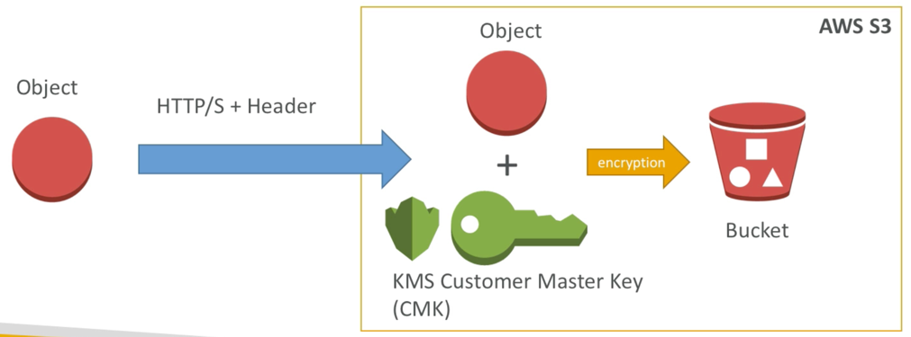
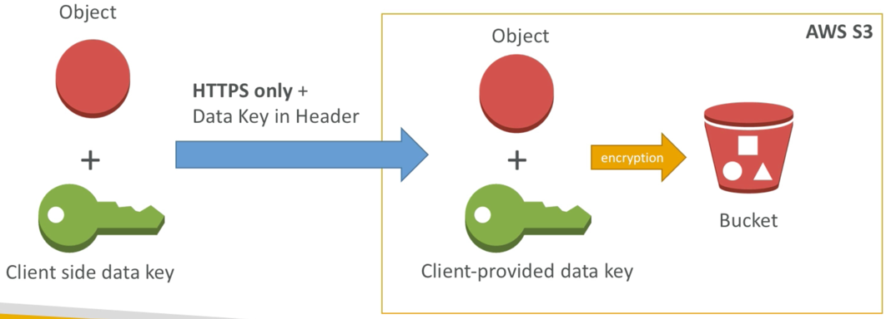
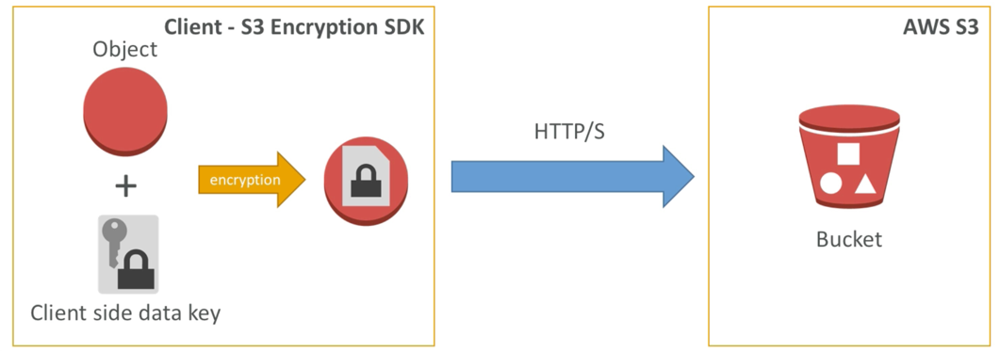

# buckets_and_objects
* Defined at the region level
* Must have globally unique name (entire AWS not just account scope)
* Can be used to store files in buckets (virtual directories)

## Naming Conventions
* No uppercase
* No underscore
* 3-63 character names
* Not an IP
* must start with lowercase letter or number (no special character)

## Objects
* Objects (files) have a key, the key is the full path
  * <my_bucket>/my_file.txt
  * <my_bucket>/myfolder/folder/file.txt
* folders are virtual, the key with slashes define the folder structure
* Object values are the content of the file
  * Max file size is 5tb
  * multi-part upload is required if file is greater than 5tb
* Metadata (key value pair)
* Tags: up to 10, i.e. security, lifecycle
* Version ID if versioning is enabled



## File Versioning
* Enabled at a bucket level
* Same key will overwrite and increment the version: 1,2,3
* Version will be null if versioning enabled on a file that was previously not enabled
* It is best practice to version your buckets:
  * Protect against accidental deletes
  * Easy rollback



## Encryption for objects
Exam has lots of questions on encryption  

4 methods of encrpytion (must know when to apply these for exam):
* SSE-S3 (UI Option: Amazon S3 Master Key): encrypts S3 objects using keys handled by AWS
  * Handled by AWS
  * AES-256
  * Must set header: ```"x-amz-server-side-encryption":"AES256"```

* SSE-KMS (UI Option: AWS KMS master-key): Leverage aws key management to manage encryption keys
  * encryption keys managed by KMS
  * KMS advantage: user control and audit trail
  * object encrypted server side
  * Must set header: ```"x-amz-server-side-encryption":"AWS:KMS"```

* SSE-C: manage own encryption keys
  * server side encryption using data keys managed by customer outside aws
  * amazon s3 does not store the encryption key you provide
  * https must be used
  * encryption keys must be provided in http header for every request made

* Client side encryption
  *  Client library such as amazon s3 encryption client
  *  Clients must encrypt/decrypt data themselves
  *  customer fully manages the keys and encryption cycle


## Encryption in transit
* AWS S3 exposes
  * HTTP endpoint (unencrypted)
  * HTTPS endpoint (encrypted in flight)
* HTTPS recommended
* HTTPS mandatory for SSE-C
* Encryption in flight also called SSL/TLS

## Default Encryption
It is possible to set default encryption on the bucket  
when set it is no longer required to specify encryption type per file when uploading  
leave the option as None in the upload dialog

# S3 Security
User based:
* IAM policies - which api calls should be allowed for a specified user from iam console

Resource Based:
* Bucket policies - bucket wide rules from the s3 console - allows cross account
* Object Access Control List (ACL) - finer grain
* Bucket Access Control List (ACL) - less common

*Exam expects IAM and Bucket policies to be known

## Bucket Policies
* Json based policies
  *  Resource: bucket and objects
  *  Actions: set of api to allow/deny
  *  effect: allow/deny
  *  principal: account or user to apply policy to
* Use S3 bucket policy to
  * Grant public access to bucket
  * Force objects to be encrypted at upload
  * Grant access to another accounbt (cross account)

## Other
* Networking
  * Supports VPC Endpoints
* Logging and Audit
  * S3 access logs can be stored in S3 bucket (dont store in same bucket as files, it will cause recursion)
  * API calls can be logged in AWS CloudTrail
* User Security
  * MFA can be required in versioned buckets to delete objects
  * Signed URLS are valid only for a limited time i.e. premium video service for logged in users

Policy to block files not specifying encryption:
```json
{
     "Version": "2012-10-17",
     "Id": "PutObjPolicy",
     "Statement": [
           {
                "Sid": "DenyIncorrectEncryptionHeader",
                "Effect": "Deny",
                "Principal": "*",
                "Action": "s3:PutObject",
                "Resource": "arn:aws:s3:::<bucket_name>/*",
                "Condition": {
                        "StringNotEquals": {
                               "s3:x-amz-server-side-encryption": "AES256"
                         }
                }
           },
           {
                "Sid": "DenyUnEncryptedObjectUploads",
                "Effect": "Deny",
                "Principal": "*",
                "Action": "s3:PutObject",
                "Resource": "arn:aws:s3:::<bucket_name>/*",
                "Condition": {
                        "Null": {
                               "s3:x-amz-server-side-encryption": true
                        }
               }
           }
     ]
 }
```

The above block can be generated using the build in policy generator https://awspolicygen.s3.amazonaws.com/policygen.html