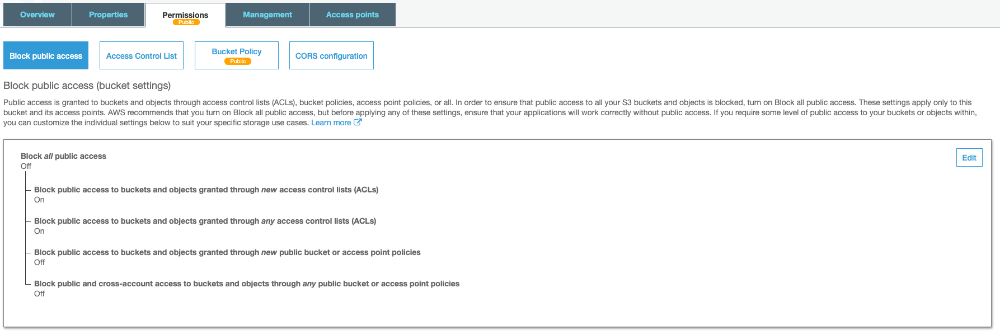
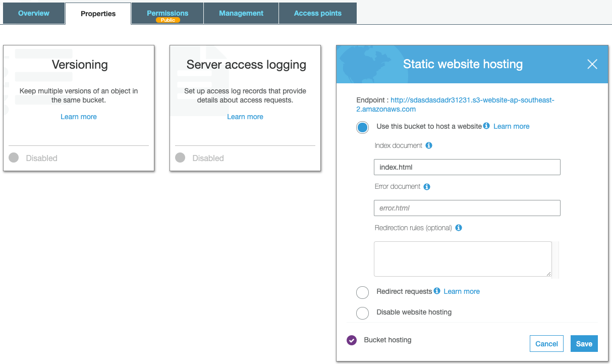

# S3 Websites
S3 Can host static websites

The website URL will be
* <bucket-name>.s3-website-<AWS-region>.amazonaws.com or
* <bucket-name>.s3-website.<AWS-region>.amazonaws.com (there is a dot between website and region)

If you get a 403, make sure policy allows public reads

Sample Webpage (index.html)
```html
<html>
    <head>
        <title>My First Webpage</title>
    </head>
    <body>
        <h1>I love coffee</h1>
        <p>Hello world!</p>
    </body>
    
</html>
```

Upload the index.html and coffee.jpg files

add a bucket policy to allow the bucket to be open to the public for reads

```json
{
    "Version": "2012-10-17",
    "Id": "Policy1578618648283",
    "Statement": [
        {
            "Sid": "Stmt1578618644902",
            "Effect": "Allow",
            "Principal": "*",
            "Action": "s3:GetObject",
            "Resource": "arn:aws:s3:::sdasdasdadr31231/*"
        }
    ]
}
```

adjust public access control



Finally configure the property for static website hosting
