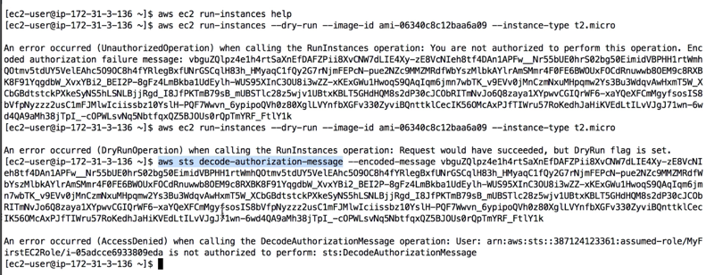

# aws-cli-sts-decode

Found on exam

If an api call fails you get a long error message, this message can be decoded by the sts command line

Command: aws sts decode-authorization-message --encoded-message <message>

