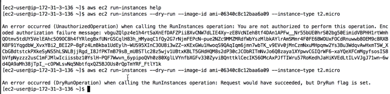

# aws_cli_dry-run

Useful to try commands without anything being actioned on aws

i.e. aws ec2 run-instances --dry-run --image-id <ami-id> --instance-type <instance-type>

the argument is --dry-run

Dry run will be able to tell you if the command would have been successful, if there are permission problems for instance

