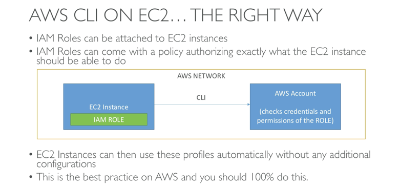

# aws_cli_on_ec2_instance

AWS credentials and keys should never existing on an ec2 instance, instead IAM roles should be assigned to the instance in the aws console

Amazon AMI's all come preinstalled with the amazon CLI

When running aws configure, we only need to set the region name, the keys can be left as None, they will be auto configured by the IAM role

We can assign an IAM role to the instance and grant it policies i.e. AmazonS3ReadOnlyAccess

