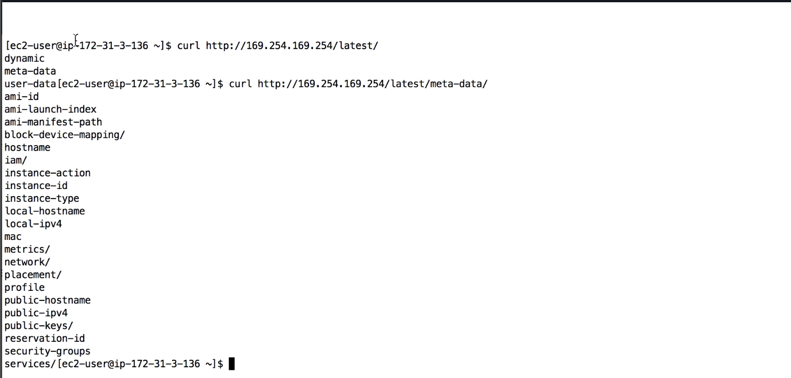
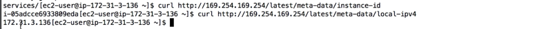
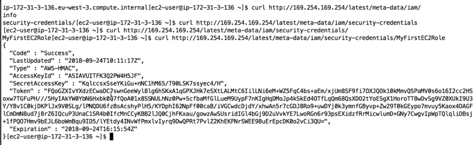

# aws_ec2_instance_metadata

It allows ec2 instances to "learn about themselves" without using an iam role

the URL is http://169.254.169.254/latest/meta-data

you can retrieve the iam role name from metadata but you cannot retrieve the iam policy

the ip address above is internal to aws and cannot be access from any external machine

Metadata= info about EC2 instance
Userdata= launch script of the EC2 instance

curl http://169.254.169.254/latest/meta-data

Any time the line ends with a slash, there is a subpath with more information

Retrieving IAM role credentials

Metadata credentials are temporary, they have an expiry, see the above response