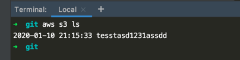
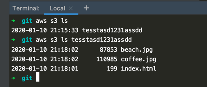
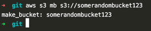
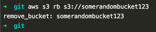

# cli_notes

CLI Command Reference: https://docs.aws.amazon.com/cli/latest/index.html

# Useful Commands
## CLI
aws configure

## S3 Buckets
### List all s3 buckets in account:
command: aws s3 ls  

### View Contents of a specific bucket:
command: aws s3 ls <bucketname>  

### Make a bucket
command: aws s3 mb s3://<bucketname>  

### Remove Bucket
aws s3 rm s3://<bucketname>  

## EC2 Instances
### run-instances
command: aws ec2 run-instances --image-id <ami-id> --instance-type <instance-type>
