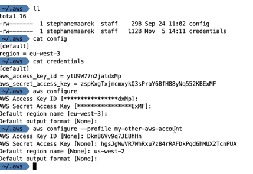
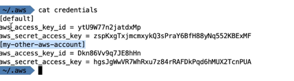
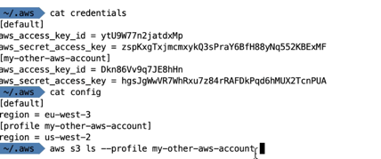

# cli_profiles

aws configure --profile <profile_name>

and proceed to configure it

View inside the aws credential file:

Executing a command against a specific profile: --profile <profilename>
i.e. aws s3 ls --profile <profilename>

Profiles wont be on the exam but good to know
