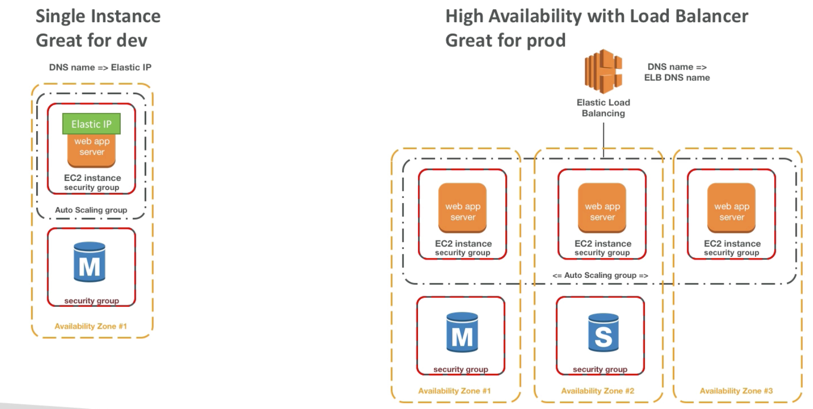
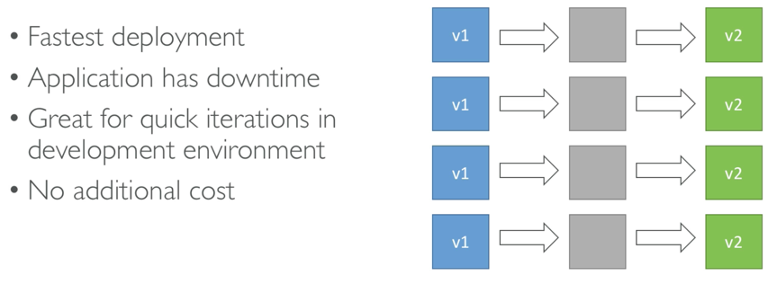
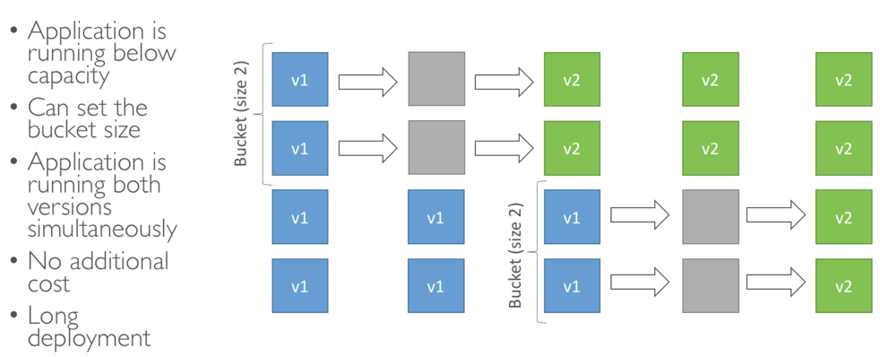
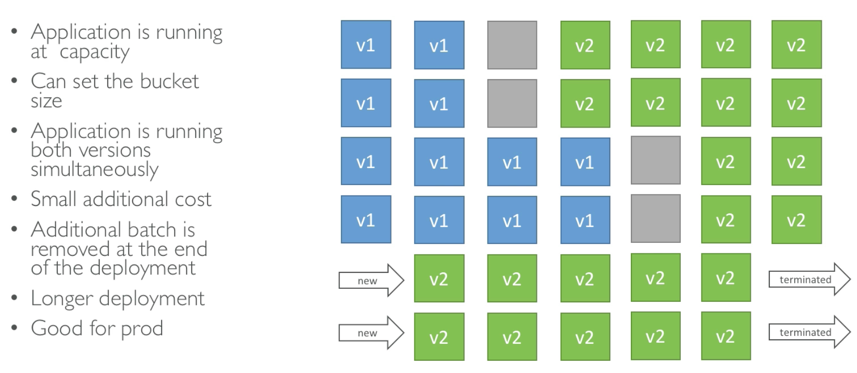
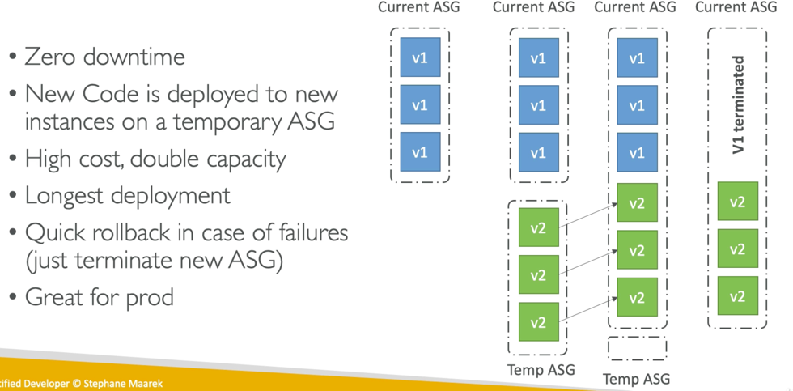
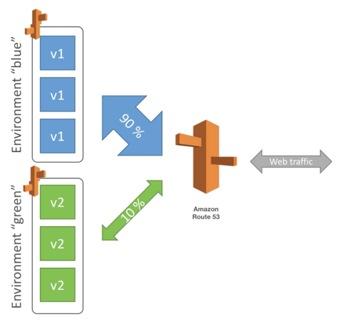
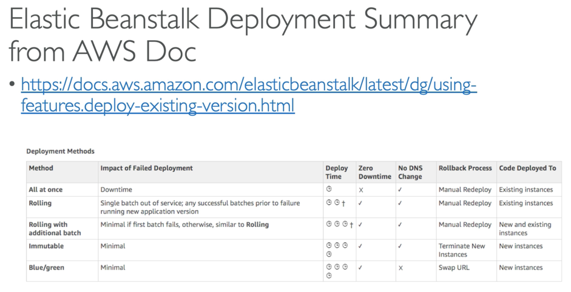

# eb_deployment_modes

Important for exam

##  Update deployment options:
### All at once
Depoy all in one go, fastest but instances arent available to serve traffic for a bit (downtime)

### Rolling
update a few instances at a time (bucket) and then move onto the next bucket once the first is healthy

### Rolling with additional batches
Similar to rolling but spins up new instances to move the batch (so old application still available)

### Immutable
Spins up new instances in a new ASG, deploys to new instances then swaps all instances when everything healthy

Might hear in the exam:
* Blue/Green
  * Not a direct feature of beanstalk
  * Zero downtime and release facility
  * Create a new stage environemtn and deploy v2 from there
  * the new environemnt green can be validated independantly and roll back issues
  * route 53 can be setup using weighted policies to redirect a little bit of traffic to the stage environment
  * using beanstalk "swap URLS" when done with the env test

## More Information:
