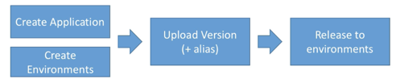

# eb_overview

## Developer problems on AWS:
* Managing infrastructure
* Deploying Code
* Configuring all the databases, load balancers
* Scaling Concerns

## Elastic Beanstalk
* Developer centric view of deploying an application to AWS
* It uses all the components we've seen before
  * EC2, ASG (auto scale group), ELB (elastic load balancer), RDS etc
* One view thats easy to make sense of
* Still have full control over the configuration
* Only pay for underlying resources

* Managed service
  *  Instance config and OS is handled by beanstalk
  *  deployment strategy handled by beanstalk

3 Architecture models
* Single instance ( good for dev )
* LB + ASG great for production or pre-production web apps
* ASG only: great for non-web apps in prod (workers etc)

Elastic BeanStalk has 3 components
* Application
* Application version: each deployment gets assigned a version
* Environment name (dev, test, prod): free naming

* you deploy application versions to environment and can promote application version to the next environments
* rollback feature to previous application version
* Full control over lifecycle of environments

* Support for many platforms
  * go
  * java
  * php
  * python
  * docker
  * etc
* If platform isn't support we can create our own

