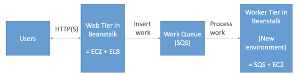

# exam_tips

Beanstalk works with https
* load ssl cert onto load balancer
* can be done from the console (eb console, load balancer config)
* can be done from code i.e. ebextensions/securelistener-alb.config
* ssl cert can be provisioned using ACM (AWS certificate manager) or CLI
* Must configure a security group rule to allow incoming port 443 (https port)

Beanstalk redirect HTTP to HTTPS
* Configure instances to redirect http to https
* or configure application load balancer with a rule
* dont redirect health checks or health will come back poor

LifeCycle policy
* Elastic beanstalk can store at most 1000 application versions
* if you dont remove old version you wont be able to deploy anymore
* to phase out old version use a lifecycle policy
  * based on time
  * based on space
* Versions that are currently used wont be deleted
* Option not to delete source bundle in S3 (to prevent data loss)

Web server vs worker environment
* If application performs tasks that are long to complete, offload these tasks to a worker environment
* decouple application into 2 tiers (common pattern)
  * Example processing a video, generating a zip would be separate to webapp
* You can define periodic tasks in a file cron.yaml

RDS with Elastic beanstalk
* RDS can be provisioned with beanstalk, which is great for dev/test
  * Not ideal for prod as database lifecycle is tied to beanstalk environment lifecycle
  * Best for prod is to decouple rds from beanstalk, provide connection string to EB
* Steps to migrate from RDS coupled in EB to standalone RDS:
  * Take RDS DB snapshot
  * Enable deletion protection in RDS
  * Create a new environment without an RDS, point to existing old RDS
  * Perform blue/green deployment and swap new and old env
  * Terminate the old environment (RDS wont be deleted due to protection)
  * Delete CloudFormation stack (will be in DELETE_FAILED state)

