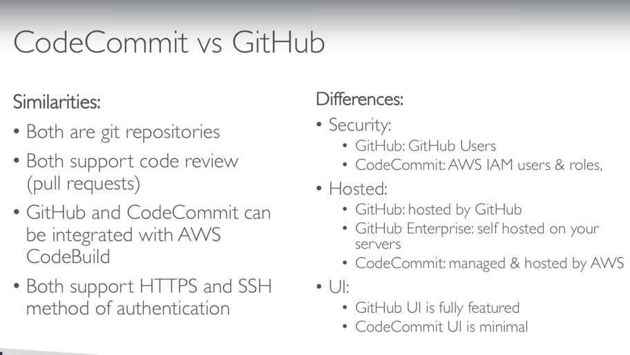

# codecommit

Version Control: ability to understand change that happened to code over time (allow rollback)
enabled by using version control system such as git

Repo lives on a central online repository and can be checked out locally

Benefits are
* collaboration
* backed up code
* viewable/auditable

CodeCommit provides
* Private git repos
* No limit on repo size (unlimited scaling)
* Fully managed, high availability
* Code only in aws cloud (increased security and compliance)
* secure, encrypted
* integrated with jenkins/codebuild etc

## CodeCommit Security
* Interactions done using GIT

###  Authentication
* SSH keys using ssh keys assinged in IAM console
* HTTPS via AWS cli authentication helper
* MFA multi factor security
* 
### Authorization in GIT
* IAM policies managed user roles/rights

### Encryption
* Encrypted at rest using KMS
* Encrypted in transit via ssh or https

### Cross account access
* Dont share ssh keys
* Dont share aws credentials
* use iam role in your aws account and use aws sts (with assumerole api)

### codecommit notificaitons
* can trigger notifications in codecommit using SNS or aws lambda or cloudwatch event rules

Use cases for notifcations in sns/lambda
* deletion of branches
* trigger for pushes that happen in master branch
* Notify build system
* trigger aws lambda to perform codebase analysis (maybe credentials got committed in code?)

Use case for cloudwatch events
* trigger pull request updates (created/updated/deleted/commented)
* Commit comment events
* Cloudwatch event rules go into sns topic

