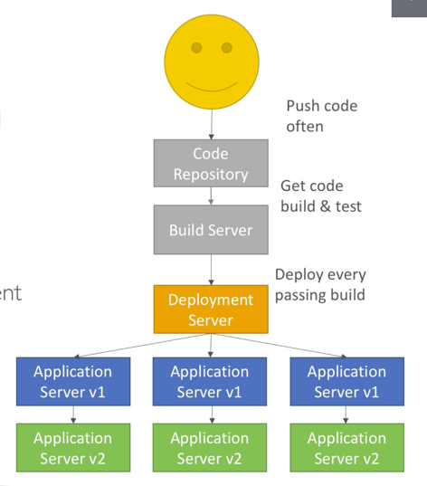
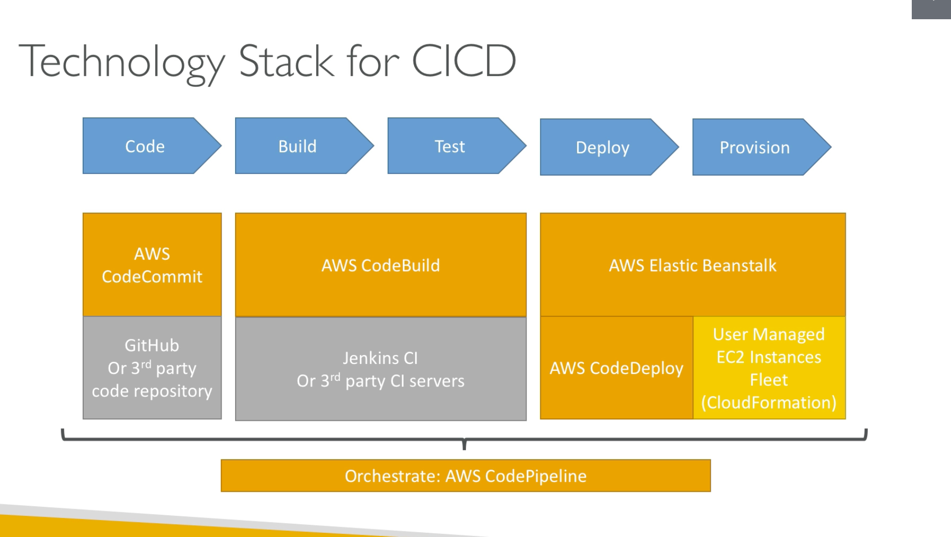

# intro

This section will cover
* AWS Codecommit: store code
* AWS CodePipeline: automate pipeline from code to beanstalk
* AWS Codebuild: build and test code
* AWS CodeDeploy: Deploy code to ec2 fleets (not beanstalk)

### Continuous Integration
* Develops push code to repository,
* integrate testing and build server checks on commit
* Developer gets feedback about pass/failed tests

### Continuous Delivery
Ensure software can be released reliably whenever needed
Ensures deployments happen often and quick
Shift away from one release every 3 months to 5 releases a day
* automated deployment
  * Codedeploy
  * Jenkins
  * Spinmaker etc

